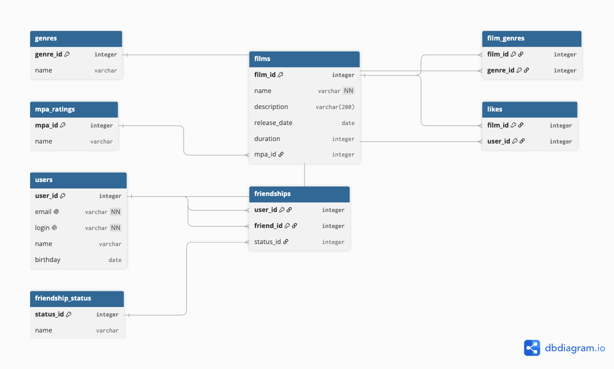

# java-filmorate

Filmorate — приложение для тех, кто любит кино. Здесь можно оценивать фильмы, добавлять друзей и смотреть, что сейчас в топе у всех.

## Как устроена база данных



Если коротко: в центре всего — фильмы и пользователи. У каждого фильма есть один возрастной рейтинг (G, PG, PG-13, R или NC-17), поэтому его храним прямо в таблице с фильмами. А вот с жанрами так не получится — у одного фильма их может быть сразу несколько, поэтому пришлось сделать отдельную табличку, которая просто связывает фильм и жанр парами. Лайки устроены так же — просто список пар «кто лайкнул что».

С друзьями чуть интереснее: дружба не появляется сразу, сначала кто-то отправляет запрос, а потом его подтверждают. Поэтому кроме самой связи между двумя пользователями храним ещё и статус — подтверждена дружба или нет.

## Примеры запросов

Все фильмы вместе с их рейтингом:
```sql
SELECT f.*, m.name AS mpa_name
FROM films f
JOIN mpa_ratings m ON f.mpa_id = m.mpa_id;
```

Топ-10 фильмов по количеству лайков:
```sql
SELECT f.film_id, f.name, COUNT(l.user_id) AS likes_count
FROM films f
LEFT JOIN likes l ON f.film_id = l.film_id
GROUP BY f.film_id
ORDER BY likes_count DESC
LIMIT 10;
```

Друзья пользователя (только те, кто подтвердил дружбу):
```sql
SELECT u.*
FROM friendships fr
JOIN users u ON u.user_id = fr.friend_id
JOIN friendship_status fs ON fs.status_id = fr.status_id
WHERE fr.user_id = ? AND fs.name = 'confirmed';
```

Общие друзья двух пользователей:
```sql
SELECT u.*
FROM friendships fr1
JOIN friendships fr2 ON fr1.friend_id = fr2.friend_id
JOIN users u ON u.user_id = fr1.friend_id
WHERE fr1.user_id = ? AND fr2.user_id = ?;
```

## Стек

Java 21, Spring Boot, Maven, Lombok. Запросы логируются через Logbook.
