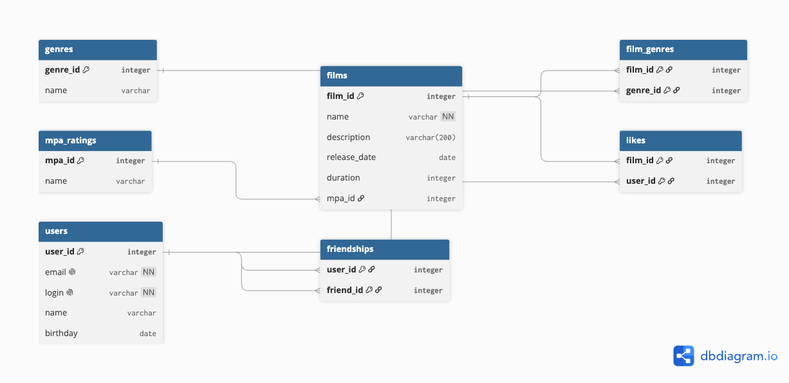
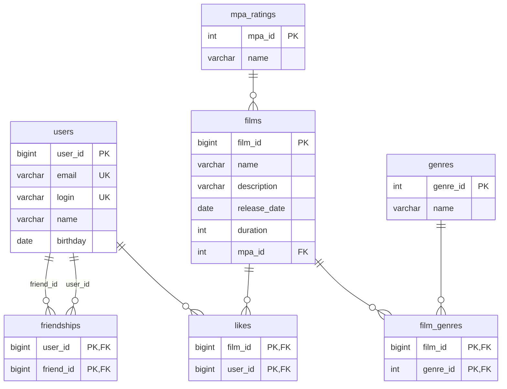

# java-filmorate

Backend-приложение для сервиса Filmorate: пользователи ставят лайки фильмам, добавляют друг друга в друзья
и получают подборку самых популярных фильмов. Данные хранятся в базе H2 (JDBC/Spring Boot).

## Стек

- Java 21, Spring Boot 3.5
- Spring Web, Spring Validation
- Spring JDBC (`JdbcTemplate`) + H2
- Lombok, Logbook (логирование HTTP-запросов)
- JUnit 5, Spring `@JdbcTest` для интеграционных тестов DAO

## Схема базы данных (ER-диаграмма)



Дружба в `friendships` **односторонняя**: строка `(user_id, friend_id)` означает, что `user_id` добавил
`friend_id` к себе в друзья. Обратная запись не создаётся автоматически. Сам факт наличия строки в таблице
означает, что дружба существует — отдельного статуса не требуется, подтверждение дружбы в проекте не
предусмотрено.

## Примеры SQL-запросов

**Список фильмов с их рейтингом и жанрами**
```sql
SELECT f.film_id, f.name, m.name AS mpa_name, g.name AS genre_name
FROM films f
LEFT JOIN mpa_ratings m ON f.mpa_id = m.mpa_id
LEFT JOIN film_genres fg ON f.film_id = fg.film_id
LEFT JOIN genres g ON fg.genre_id = g.genre_id
ORDER BY f.film_id;
```

**Топ-N популярных фильмов по количеству лайков**
```sql
SELECT f.film_id, f.name, COUNT(l.user_id) AS likes_count
FROM films f
LEFT JOIN likes l ON f.film_id = l.film_id
GROUP BY f.film_id, f.name
ORDER BY likes_count DESC
LIMIT 10;
```

**Список друзей пользователя**
```sql
SELECT u.*
FROM users u
JOIN friendships f ON u.user_id = f.friend_id
WHERE f.user_id = ?;
```

**Общие друзья двух пользователей**
```sql
SELECT u.*
FROM users u
JOIN friendships f1 ON u.user_id = f1.friend_id AND f1.user_id = ?
JOIN friendships f2 ON u.user_id = f2.friend_id AND f2.user_id = ?;
```

## Эндпоинты

| Метод | Путь | Описание |
|---|---|---|
| GET | `/films` | список всех фильмов |
| GET | `/films/{id}` | фильм по id |
| POST | `/films` | добавить фильм |
| PUT | `/films` | обновить фильм |
| PUT | `/films/{id}/like/{userId}` | поставить лайк |
| DELETE | `/films/{id}/like/{userId}` | убрать лайк |
| GET | `/films/popular?count=N` | N самых популярных фильмов |
| GET | `/users` | список всех пользователей |
| GET | `/users/{id}` | пользователь по id |
| POST | `/users` | зарегистрировать пользователя |
| PUT | `/users` | обновить пользователя |
| PUT | `/users/{id}/friends/{friendId}` | добавить в друзья (односторонне) |
| DELETE | `/users/{id}/friends/{friendId}` | удалить из друзей |
| GET | `/users/{id}/friends` | список друзей пользователя |
| GET | `/users/{id}/friends/common/{otherId}` | общие друзья |
| GET | `/genres` | список жанров |
| GET | `/genres/{id}` | жанр по id |
| GET | `/mpa` | список рейтингов MPA |
| GET | `/mpa/{id}` | рейтинг MPA по id |

## Запуск

```bash
mvn spring-boot:run
```

Файл базы данных создаётся автоматически в `./db/filmorate.mv.db` при первом запуске и сохраняется
между перезапусками приложения. Схема (`schema.sql`) и справочные данные (`data.sql`, жанры и рейтинги
MPA) применяются автоматически при каждом старте.

## Тесты

```bash
mvn test
```

Интеграционные тесты DAO-слоя (`src/test/.../storage`) поднимают приложение через `@JdbcTest` +
`@AutoConfigureTestDatabase` на резидентной (in-memory) базе H2, независимой от рабочей файловой базы.
